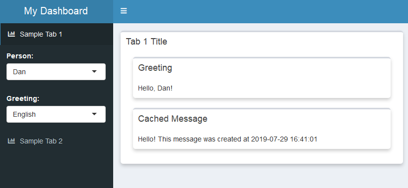

# shinyDashboardPlus Template

## Overview

This project includes a basic template that I have found useful for developing shiny dashboards.  It use the basic layout shown below:



This layout includes:
* A sidebar menu to select different dashboard views
* The ability to embed controls for each dashboard in the sidebar under the menu item
* The ability to use chained selectors as controls

Additional features I'd like to add include:
* Links to move between dashboard views
* Links that also initialize controls with specific values
* Using pooled database connections instead of shared ones

You should be able to download this template, begin modifying it, and create a new dashboard.  The code files are commented to describe what each is doing.  A high-level overview of components is provided below.

## Project Layout

The project includes the following files:

* app.R - Main script and entry point for application.  Includes high-level UI and delegates logic for each tab to a separate file.
* globals.R - Global include file that loads packages and sets up shared services and database connections
* config.R - Configuration information.  This is used for database connections and anything else that may change when dashboard is deployed to production.
* tab1.R & tab2.R - Code for individual dashboard tabs.  This includes the UI and server logic for each tab.
* HelloService.R - A sample service object that can be used to retrieve data
* HelloServiceTest.R - Simple Test code to test the service separately from the dashboard

## High-level Layout (app.R)

The high-level layout is defined in the "app.R" file.  This includes the following sidebar definition:

```{r}
sidebar = dashboardSidebar(
  sidebarMenu(
    id="sidebarmenu",

    menuItem(
      text = "Sample Tab 1",
      tabName = "TAB1",
      icon = icon("chart-bar")
    ),
    conditionalPanel(
      "input.sidebarmenu === 'TAB1'",
      uiOutput("TAB1_CONTROLS")
    ),

    menuItem(
      text = "Sample Tab 2",
      tabName = "TAB2",
      icon = icon("chart-bar")
    )

  )
)
```

This creates the sidebar menu items for each dashboard.  The ```conditionalPanel``` contains the sidebar controls that are only visible when the specific dashboard is selected.  Each dashboard is able to generate its own controls.  In this case, the tab is expected to output them as "TAB1_CONTROLS" when the server logic for that tab is invoked.

The dashboard body is similarly created with:

```
tabItems(
  tabItem(
    tabName = "TAB1",
    box(
      title = "Tab 1 Title",
      width = NULL,
      uiOutput("TAB1_BODY")
    )
  ),
  tabItem(
    tabName = "TAB2",
    box(
      title = "Tab 2 Title",
      width = NULL,
      uiOutput("TAB2_BODY")
    )
  )
)
```

Once again, each tab is responsible for creating its own output - in this case as "TAB1_BODY" and "TAB2_BODY".  This allows the code file for each tab to define its own body.  Each tab file is expected to define a ```server``` function that we then invoke from the main ```server``` function as shown:

```
server <- function(input, output, session) {
  TAB1_SERVER(input, output, session)
  TAB2_SERVER(input, output, session)
}
```

The goal of all this is to let the individual tabs define their own UI for their input controls and display.  Minimal UI and logic are contained in the main ```app.R``` file.  When adding a new tab, the only things that need to change are:

1. The code for the tab needs to be sourced in ```globals.R```
2. An entry needs to be added in ```app.R``` for the menu item (as well as a placeholder for its input controls - if applicable)
3. A line needs to be added in the ```server``` function of ```app.R``` that will dispatch to the server logic for that tab

A minimal tab code file could then be as simple as:

```
TAB2_SERVER <- function(input, output, session) {

  output$TAB2_BODY <- renderUI({

    ui <- box(
      title="Sample Tab",
      width=12,
      tags$div("Hello World")
    )

    return(ui)
  })

}
```

## Input Controls

If a dashbaord has input controls that you want to display in the sidebar when it is selected, these can be added to the ```output``` parameter.  I suggest prefixing everything relating to a specific tab with the name of that tab.  If you tab is named ```TAB1``` you would create ```TAB1_BODY``` as the main dashboard output and ```TAB1_CONTROLS``` for the sidebar controls.  Any variables used in the controls should also be prefixed to avoid collisions with variables from other tabs.

We then might have something like below:

```
output$TAB1_CONTROLS <- renderUI({

  people_options   <- get_people_options()
  greeting_options <- reactive_greeting_options()

  controls <- list(

    selectInput(
      "TAB1_PERSON",
      "Person:",
      people_options,
      selected=input$TAB1_PERSON
    ),

    tags$div(
      class=ifelse(is.null(greeting_options), 'hidden', ''),
      selectInput(
        "TAB1_GREETING",
        "Greeting:",
        greeting_options,
        selected=input$TAB1_GREETING
      )
    )

  )

  return(controls)
})
```

This outputs a list of ```selectInput``` controls for the sidebar.  The code above also provides an example of using chained selectors.  The second selector will be hidden if ```greeting_options``` is ```NULL```.  The logic that generates these options just needs to check and see if an option has been selected for the first selector.

Here is the logic that generates the option lists:

```
get_people_options <- function() {
  v_options <- unique(df_people$PERSON)
  v_options <- c("Select" = "", v_options)
  return(v_options)
}

reactive_greeting_options <- reactive({

  if (any(input$TAB1_PERSON != "")) {
    df_active_people    <- df_people %>% filter(PERSON == input$TAB1_PERSON)
    df_active_greetings <- df_greetings %>% filter(LANGUAGE %in% df_active_people$LANGUAGE)

    v_options        <- df_active_greetings$GREETING
    names(v_options) <- df_active_greetings$LANGUAGE

    v_options <- c("Select" = "", v_options)
    return(v_options)
  }

  return(NULL)
})
```

The important part if this is the line:

```
if(any(input$TAB1_PERSON != "")) {...}
```

This will evaluate to ```TRUE``` only if the user has selected something for ```TAB1_PERSON```.  In this case, it will return a set of options for the second selector.  Otherwise, it will return ```NULL``` and the second selector won't be displayed.

Note also that the logic for the second selector is a reactive function. This means it won't execute unless one of the variables it depends on is changed.  In this case it will be re-executed if ```input$TAB1_PERSON``` changes and can update the display.

## Service Objects

The ```HelloService.R``` file demonstrates a service object whose goal is to provide data.  This object interacts with databases, fetches data, and can prep the data for the dashboard.  It is defined as an R6 class which might seem weird at first, but I like to use classes in the service layer for a few reasons:

1. The R6 class encapsulates all of the functions needed to interact with the database.  It does not pollute the global namespace with all of these functions and instead only exports one thing: the class definition.  When the class is instantiated, you once again only have one object in your environment containing all of this functionality (which may include dozens of functions)
2. If you need to cache data you can cache it inside the object.  Once again, you won't pollute your namespace with these cached objects.  You can even make the cached objects private (which is recommended) to make sure no one else tries to access them directly.
3. You can change details of how the service object works without having to modify your dashboard.  For example: you can cache objects behind the scenes if needed and the user of the service object will never need to know about these changes.
4. You can create a mock service object for testing.  This is useful if you want to make UI changes to your dashboard and have very complicated data that takes a long time to load.  Instead of hitting a database, re-generating data every time you restart the app, you can create a mock service object that just returns cached data from a file and greatly improve the speed of your development.  The dashboard shouldn't care if it gets the real service object or a mock one.  All you have to change is one line in the ```globals.R``` file where you load the service object.
5. You can easily test your service logic and database access logic separately from your dashboard.  For an example: see ```HelloServiceTest.R``` which instantiates the ```HelloService``` object and makes a few sample function calls.
